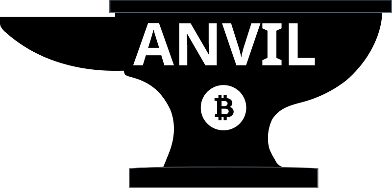

<p align="center">
  
</p>

[](LICENSE.md)

# Anvil Wallet

A fork of [Yours Wallet](https://github.com/yours-org/yours-wallet)
with two targeted hardening upgrades. Non-custodial BSV / 1Sat
Ordinals / MNEE wallet. BRC-100 compatible.

## What's the same as upstream Yours Wallet

All cryptography, key management, seed format, BIP32 derivation paths,
BRC-100 provider surface (`window.yours.*`), 1Sat Ordinals support,
MNEE integration, multi-account, UI screens. See [LICENSE.md](LICENSE.md) —
MIT, preserved from upstream; copyright for the base wallet remains
with Daniel Wagner and David Case.

## The Two Upgrades

### 1. Security — `axios` removed

All HTTP calls use the browser's native `fetch` API. No third-party
HTTP library in the wallet's dependency tree. Mitigates the 2024
`axios` supply-chain attack vector by removing the entire attack surface.

> This was also merged upstream via
> [yours-org PR #300](https://github.com/yours-org/yours-wallet/pull/300),
> so Anvil Wallet inherits this rather than being the originator.

### 2. Multi-source chain data

Yours Wallet (and forks of it) historically depended on a single pair
of indexers (`ordinals.1sat.app` + `ordinals.gorillapool.io`). When
those degrade, the wallet hangs. Anvil Wallet chains through
additional sources with fail-closed ordinal safety:

- **Fund UTXO lookup**: spv-store primary → WhatsOnChain fallback,
  with a local 1Sat inscription-envelope filter so the fallback path
  never spends an ordinal as fungible BSV
- **Broadcast**: Anvil-Mesh → spv-store → WhatsOnChain
- **Mesh health pre-flight**: skips Anvil-Mesh quickly when it
  self-reports its broadcast upstream as down

All three paths are opt-out by default — if you don't configure
Anvil-Mesh, they fall through silently to spv-store, identical to
upstream behavior.

## Minor additions

- **Theme**: renamed from "Yours" to "Anvil" in the manifest + theme file
- **GetSignaturesRequest timeout**: the sign popup no longer deadlocks
  when the 1Sat indexer is degraded (6-second timeout + minimal
  preview fallback)
- **`sendMNEEWithData` provider extension**: lets a connected dApp
  request a user-half-signed MNEE transfer with optional OP_RETURN
  data, useful for AVOS-style oracle-attested swaps. Additive;
  existing `sendMNEE` flow unchanged.

## Install

### Developer / unpacked

```bash
git clone https://github.com/BSVanon/Anvil-Wallet.git
cd Anvil-Wallet
npm install --legacy-peer-deps
npm run build
```

Load unpacked extension from `./build/` in `chrome://extensions`
(Developer mode on).

### Chrome Web Store

*Coming soon.*

## Upstream sync

To pull updates from `yours-org/yours-wallet` when upstream ships:

```bash
git fetch upstream
git rebase upstream/main    # replays the 7 Anvil patches on top of new upstream
```

Or use the "Sync fork" button in the GitHub UI.

## License

[MIT](LICENSE.md). Copyright for the base wallet remains with Daniel
Wagner and David Case. Anvil-specific additions are dedicated to the
same MIT terms; see commit history for authorship.

## Credits

Forked from [yours-org/yours-wallet](https://github.com/yours-org/yours-wallet)
at commit `75b18b1`.
